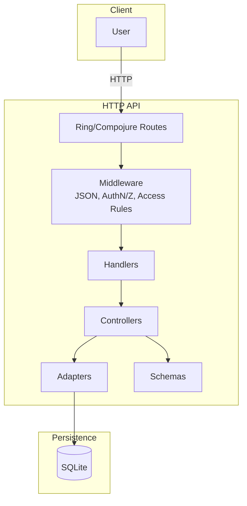

# ⚽️ 100Fôlego API

A Clojure HTTP API to organize casual soccer (pelada) with friends: manage users/players, organizations, game days (peladas), teams, round‑robin matches with constraints, substitutions, and post‑game voting with normalized scores. Built on Ring/Compojure, next.jdbc (SQLite), and Buddy Auth.

---

### 📖 Overview
- **Authentication**: Register/login, JWT auth (`Authorization: Token <jwt>`). Only `/auth/register` and `/auth/login` are public.
- **Users/Players**: Users are the system’s identities; players are users inside an organization.
- **Organizations**: CRUD organizations; scope players and peladas per organization.
- **Peladas (Game Days)**: Create, configure (`num_teams`, `players_per_team`), begin (generate schedule), close.
- **Teams**: Create teams per pelada; manage team membership.
- **Matches**: Round‑robin schedule with constraints (no >2 consecutive plays or rests), update scores.
- **Substitutions**: Record player in/out for a specific match.
- **Voting & Scores**: 1–5 star votes (no self‑vote), compute normalized scores (1–10).
- **JSON everywhere**: All endpoints always return JSON bodies, including errors and deletes.

---

### 🚀 Installation

- Local (Lein):
```bash
# Run tests
lein test

# Start dev REPL (optional)
lein repl

# Run the app (AOT main: api-100folego.core)
lein run
```

- Docker:
```bash
# Build
docker build -t api-100folego:latest .

# Run (ephemeral DB inside the container)
docker run --rm -p 8080:8080 api-100folego:latest

# Run with persistent SQLite DB + custom config
docker run --rm -p 8080:8080 \
  -v "$(pwd)/100folego.db:/app/100folego.db" \
  -v "$(pwd)/resources/config.json:/app/resources/config.json:ro" \
  api-100folego:latest
```

---

### 🛠️ Usage

- Health check (example — adjust to your routes):
```bash
curl -i http://localhost:8080/auth/login -X POST \
  -H 'Content-Type: application/json' \
  -d '{"email":"user@example.com","password":"s3cret"}'
```

- Typical flow:
  1. Register → `/auth/register` (POST)
  2. Login → `/auth/login` (POST) → receive `token`
  3. Send `Authorization: Token <token>` for all `/api/**` routes
  4. Create Organization → `/api/organizations` (POST)
  5. Add Players (users into organization) → `/api/players` (POST)
  6. Create Pelada → `/api/peladas` (POST), set config, begin
  7. Create Teams → `/api/teams` (POST), add players to teams
  8. Begin Pelada → generates Matches → `/api/matches`
  9. Update Match scores → `/api/matches/:id` (PUT)
  10. Substitutions → `/api/substitutions` (POST)
  11. Votes → `/api/votes` (POST); compute normalized scores

- Auth header example:
```bash
-H "Authorization: Token <jwt>"
```

---

### 📦 Technologies
- **Language/Runtime**: Clojure 1.11, JVM 21
- **Web**: Ring, Compojure
- **Auth**: Buddy (sign, auth, hashers) with HS512 JWT
- **DB**: SQLite (`org.xerial/sqlite-jdbc`), next.jdbc, HikariCP
- **Schemas**: Prismatic Schema
- **Components**: Stuart Sierra Component
- **Testing**: clojure.test, ring-mock
- **Build**: Leiningen, Docker (multi‑stage)

---

### 🔧 Configuration
- Config file: `resources/config.json`
```json
{"jwt-secret": "secret"}
```
- Keys:
  - **jwt-secret**: Symmetric key for JWT signing (HS512).
- DB: SQLite file `100folego.db` in working dir; handled by HikariCP via `components.clj`.
- Port: `8080` (see `components.clj`).

Override in Docker by bind mounting updated files into `/app` (see Docker run example above).

---

### ✅ Requirements
- JDK 21+
- Leiningen
- SQLite (embedded via JDBC driver; no external server required)
- Docker (optional, for containerized runs)

---

### 🗂️ Repository Structure
```text
/                      # Project root
├─ project.clj         # Leiningen config (deps, main, test paths, migratus)
├─ pom.xml             # Maven interop (generated/maintained for IDEs if needed)
├─ 100folego.db        # SQLite DB file (local dev; can be regenerated)
├─ resources/
│  ├─ config.json      # App configuration (JWT secret, etc.)
│  └─ migrations/
│     └─ 20251028150000-init_all.up.sql  # Consolidated schema for all tables
├─ src/api_100folego/
│  ├─ core.clj         # Entry point (-main) starting the Component system
│  ├─ components.clj   # System wiring: DB, App, WebServer (Jetty on :8080)
│  ├─ server.clj       # Ring app stack (middleware) and `app`
│  ├─ routes.clj       # Compojure routes & access rules
│  ├─ config.clj       # Loads config.json
│  ├─ helpers/         # Shared helpers (responses, exceptions, misc)
│  ├─ models/          # Schema definitions for entities
│  ├─ adapters/        # in→model, db→model, model→out conversions
│  ├─ controllers/     # Business logic per entity (auth, pelada, team, etc.)
│  ├─ db/              # next.jdbc data access (CRUD, queries)
│  ├─ handlers/        # HTTP handlers mapping to controllers
│  ├─ logic/           # Scheduling and other core algorithms
│  └─ wire/            # (Reserved) request/response wire types
├─ dev/
│  └─ dev.clj          # REPL support with component.repl
├─ test/
│  ├─ unit/            # Unit tests (pure functions, small scope)
│  ├─ integration/     # Integration tests (end-to-end HTTP flows)
│  └─ api_100folego/test_helpers.clj  # Test utilities (DB reset, auth, decode)
├─ Dockerfile          # Multi-stage build (uberjar + slim runtime)
├─ CHANGELOG.md        # Changes over time
├─ LICENSE             # MIT License
└─ README.md           # This file
```

- **Database schema (consolidated)** includes: `Users`, `Organizations`, `Positions`, `OrganizationPlayers`, `Peladas`, `Teams`, `TeamPlayers`, `Matches`, `MatchSubstitutions`, `Statistics`, `Votes`.
- **Access control** via Buddy access rules; only `/auth/register` and `/auth/login` are public.
- **JSON responses** enforced centrally in `helpers/responses.clj`.

---

### 🔗 Flow Chart (Mermaid)


---

### Common Endpoints (high level)
- `POST /auth/register`, `POST /auth/login`
- `GET/PUT/DELETE /api/user/:id`
- `POST/GET/PUT/DELETE /api/organizations`
- `POST/GET/PUT/DELETE /api/players`
- `POST/GET/PUT/DELETE /api/peladas`
- `POST/GET/PUT/DELETE /api/teams`
- `GET/PUT /api/matches` and `/api/matches/:id`
- `POST /api/substitutions`
- `POST/GET /api/votes`

All `/api/**` require `Authorization: Token <jwt>`.

---

### Development Tips
- Clean DB during dev: delete `100folego.db` and restart; tests recreate schema directly from the consolidated SQL.
- Test helpers handle JWT auth and tolerant JSON decoding.
- Middleware order is important; see `server.clj` for final working order.

---

### License
MIT License. See `LICENSE`.
