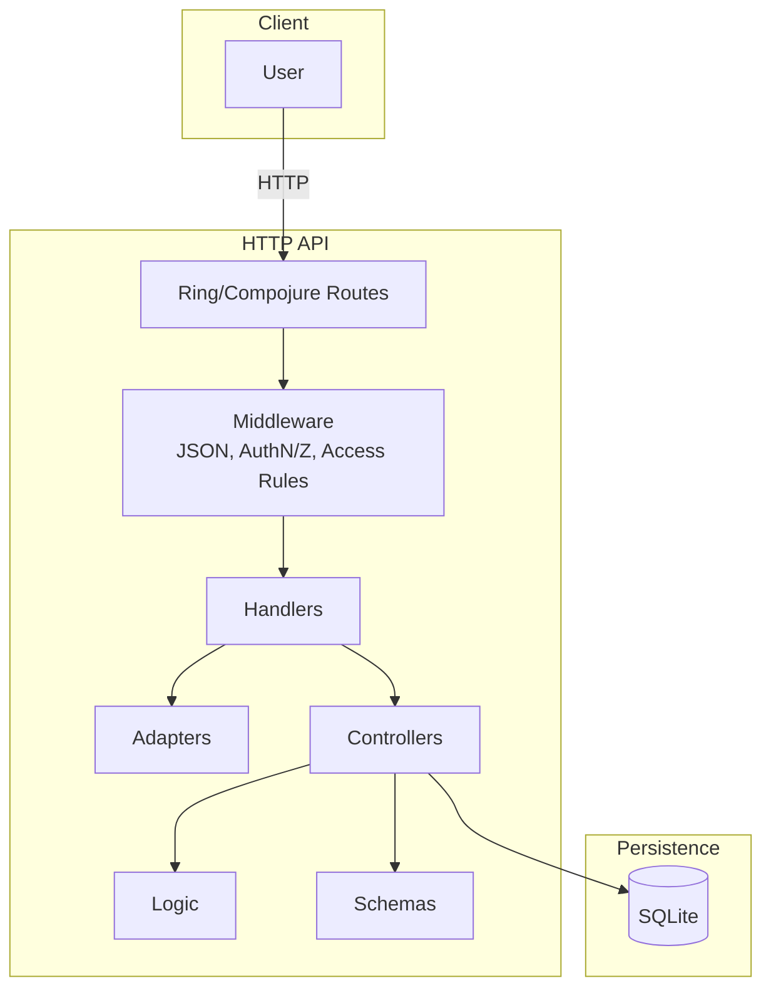

# ⚽️ PeladaApp API

A Clojure HTTP API to organize casual soccer (pelada) with friends: manage users/players, organizations, game days (peladas), teams, round‑robin matches with constraints, substitutions, and post‑game voting with normalized scores. Built on Ring/Compojure, next.jdbc (SQLite), and Buddy Auth.

---

### 📖 Overview
- **Authentication**: Register/login, JWT auth (`Authorization: Token <jwt>`). Only `/auth/register` and `/auth/login` are public.
- **Users/Players**: Users are the system’s identities; players are users inside an organization.
- **Organizations**: CRUD organizations; scope players and peladas per organization.
- **Peladas (Game Days)**: Create, configure (`num_teams`, `players_per_team`), begin (generate schedule), close. 
- **Team Randomization**: Randomly assign players to teams based on normalized scores and available slots.
- **Voting & Scores**: 1–5 star votes (no self‑vote), compute normalized scores (1–10) based on weighted averages.
- **JSON everywhere**: All endpoints always return JSON bodies, including errors and deletes.

---

### 🚀 Installation

- Local (Lein):
```bash
# Run tests
lein test

# Start dev REPL (optional)
lein repl

# Run the app (AOT main: api-peladaapp.core)
lein run
```

- Docker:
```bash
# Build
docker build -t api-peladaapp:latest .

# Run (ephemeral DB inside the container)
docker run --rm -p 8080:8080 api-peladaapp:latest
```

---

### 🛠️ Port Configuration
- **Development (lein ring server-headless)**: Uses port **8000** (defined in `project.clj`).
- **Production (lein run / uberjar)**: Uses port **8080** (hardcoded in `components.clj`).

---

### 🔧 Technologies
- **Language/Runtime**: Clojure 1.11, JVM 21
- **Web**: Ring, Compojure, Jetty
- **Auth**: Buddy (sign, auth, hashers) with HS512 JWT
- **DB**: SQLite (`org.xerial/sqlite-jdbc`), next.jdbc, HikariCP, Migratus
- **Schemas**: Prismatic Schema
- **Components**: Stuart Sierra Component for lifecycle management
- **Algorithms**: clojure.math.combinatorics for match scheduling
- **Testing**: clojure.test, ring-mock

---

### 🔧 Configuration
- Config file: `resources/config.json`
```json
{"jwt-secret": "your-very-secret-key"}
```
- **jwt-secret**: Symmetric key for JWT signing (HS512).
- **DB**: SQLite file `peladaapp.db` in working dir; handled by HikariCP via `components.clj`.
- **Migrations**: Managed by Migratus, located in `resources/migrations`.

---

### 🗂️ Repository Structure
```text
/                      # Project root
├─ project.clj         # Leiningen config (deps, main, test paths, migratus)
├─ Dockerfile          # Multi-stage production build
├─ Dockerfile.dev      # Development Docker build
├─ dev/                # Development helpers (REPL, user.clj)
├─ doc/                # Documentation
├─ scripts/            # SQL scripts for data seeding/fixing
├─ resources/
│  ├─ config.json      # App configuration (JWT secret, etc.)
│  └─ migrations/      # SQL migrations (Migratus)
├─ src/api_peladaapp/
│  ├─ core.clj         # Entry point (-main) starting the Component system
│  ├─ components.clj   # System wiring: DB, App, WebServer (Jetty)
│  ├─ config.clj       # Configuration loading
│  ├─ server.clj       # Ring app stack (middleware) and `app`
│  ├─ routes.clj       # Compojure routes & access rules
│  ├─ handlers/        # HTTP handlers mapping to controllers
│  ├─ controllers/     # Business logic orchestration
│  ├─ logic/           # Pure functional core logic (scheduling, scores, etc.)
│  ├─ db/              # next.jdbc data access (CRUD, queries)
│  ├─ models/          # Schema definitions (Prismatic)
│  ├─ adapters/        # Data transformation (DB <-> Model <-> API)
│  ├─ requests/        # Input schema validation/coercion
│  ├─ responses/       # Output schema validation/formatting
│  ├─ helpers/         # Shared helpers (responses, pagination, etc.)
├─ test/
│  ├─ api_peladaapp/   # Test helpers
│  ├─ unit/            # Unit tests
│  ├─ integration/     # End-to-end HTTP tests
```

---

### License
MIT License. See `LICENSE`.

- **Database schema (consolidated)** includes: `Users`, `Organizations`, `Positions`, `OrganizationPlayers`, `OrganizationAdmins`, `Peladas`, `Teams`, `TeamPlayers`, `Matches`, `MatchEvents`, `MatchLineups`, `MatchSubstitutions`, `Statistics`, `Votes`.
- **Access control** via Buddy access rules; only `/auth/register` and `/auth/login` are public.
- **JSON responses** enforced centrally in `helpers/responses.clj`.

---

### 🔗 Flow Chart (Mermaid)

```mermaid
flowchart TD
  subgraph Client
    U[User]
  end

  subgraph API[HTTP API]
    A[Ring/Compojure Routes]
    M[Middleware\nJSON, AuthN/Z, Access Rules]
    H[Handlers]
    D[Adapters]
    C[Controllers]
    L[Logic]
    S[Schemas]
  end

  subgraph Data[Persistence]
    DB[(SQLite)]
  end

  U -->|HTTP| A --> M --> H
  H --> D
  H --> C
  C --> L
  C --> S
  C --> DB
```

---

### Common Endpoints (high level)
- `POST /auth/register`, `POST /auth/login`
- `GET /api/users` (paginated)
- `GET/PUT/DELETE /api/user/:id`
- `POST/GET /api/organizations` (GET paginated)
- `POST /api/players`, `GET /api/organizations/:id/players`
- `POST/GET /api/peladas`, `POST /api/peladas/:id/begin`, `POST /api/peladas/:id/close`, `POST /api/peladas/:id/teams/randomize`
- `POST/GET /api/teams`
- `GET /api/peladas/:id/matches`, `PUT /api/matches/:id/score`
- `POST /api/matches/:id/events`, `DELETE /api/matches/:id/events`
- `POST /api/matches/:id/lineups`
- `POST /api/matches/:id/substitutions`
- `POST /api/votes`, `GET /api/peladas/:id/votes`
- `POST /api/scores/normalized`

All `/api/**` require `Authorization: Token <jwt>`.

---

### Development Tips
- Clean DB during dev: delete `peladaapp.db` and restart; tests recreate schema directly from the consolidated SQL.
- Test helpers handle JWT auth and tolerant JSON decoding.
- Middleware order is important; see `server.clj` for final working order.

---

### License
MIT License. See `LICENSE`.
