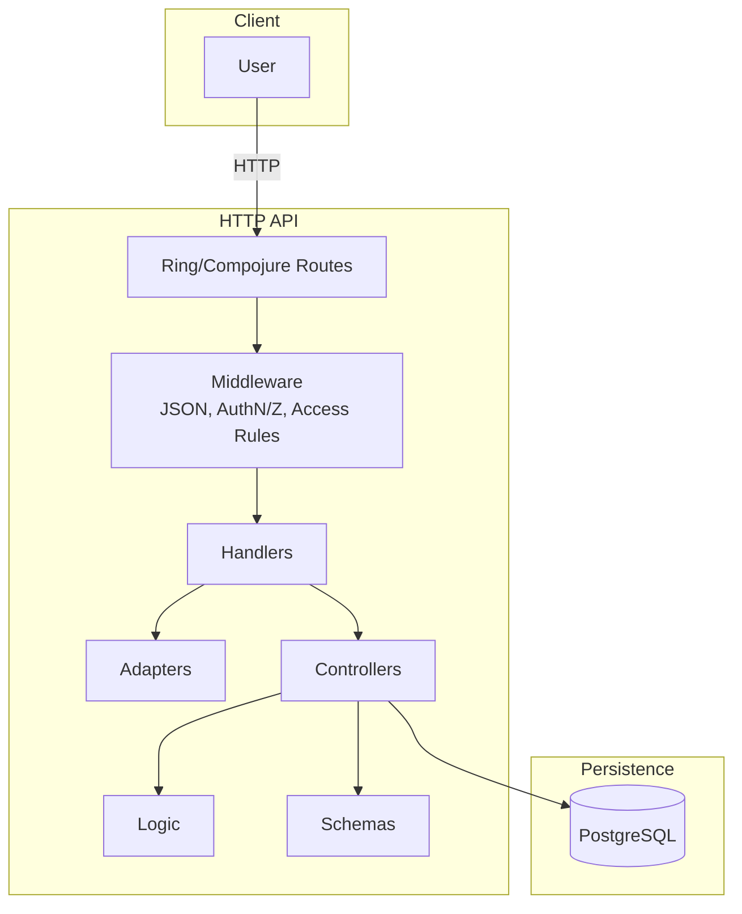

# ⚽️ PeladaApp API

A Clojure HTTP API to organize casual soccer (pelada) with friends: manage users/players, organizations, game days (peladas), teams, round‑robin matches with constraints, substitutions, and post‑game voting with normalized scores. Built on Ring/Compojure, next.jdbc (PostgreSQL), and Buddy Auth.

---

### 📖 Overview
- **Authentication**: Register/login, Cookie-based auth (`authToken` cookie). Only /auth/register and /auth/login are public.

- **Users/Players**: Users are the system’s identities; players are users inside an organization. Users can update their profiles.
- **Organizations**: CRUD organizations; scope players and peladas per organization. Manage organization admins and view statistics.
- **Peladas (Game Days)**: Create, configure (`num_teams`, `players_per_team`), manage attendance, begin (generate schedule), and close.
- **Match Management**: Manage matches, lineups, substitutions, and events (goals, cards).
- **Team Randomization**: Intelligent "Bucket Shuffle" algorithm that balances teams by technical level and position while ensuring variety across multiple draws.
- **Voting & Scores**: 1–5 star votes (no self‑vote), batch voting support, and normalized scores (1–10) based on weighted averages.
- **JSON everywhere**: All endpoints always return JSON bodies, including errors and deletes.

---

### 🚀 Installation

- Local (Leiningen):
```bash
# Run tests
lein test

# Start dev REPL (optional)
lein repl

# Run the app (AOT main: api-peladaapp.core)
lein run
```

- Docker:
Always prefer running commands inside the backend container when the environment is up:
```bash
# Run tests inside container
docker compose exec backend lein test

# Run code analysis (clj-kondo + clojure-lsp check)
docker compose exec backend lein lint

# Apply automated formatting and namespace cleaning
docker compose exec backend lein lint-fix
```

### 🛠️ Development Workflow
- **Formatting**: We use `clojure-lsp` for formatting and namespace cleaning.
- **Linting**: We use `clj-kondo` for static analysis.
- **CI/Pre-commit**: Always run `lein lint-fix` before committing to ensure the codebase remains consistent and clean.

---

### 🛠️ Port Configuration
- **Development (lein ring server-headless)**: Uses port **8000** (defined in `project.clj`).
- **Production (lein run / uberjar)**: Uses port **8080** (hardcoded in `components.clj`).

---

### 🔧 Technologies
- **Language/Runtime**: Clojure 1.12, JVM 23 (Temurin)
- **Web**: Ring 1.13, Compojure 1.7, Jetty
- **Auth**: Buddy (sign, auth, hashers) with HS512
- **DB**: PostgreSQL, next.jdbc, HikariCP, Migratus, HoneySQL.
- **Schemas**: Prismatic Schema
- **Components**: Stuart Sierra Component for lifecycle management
- **Algorithms**: Bucket Shuffle for team randomization; Iterated Local Search (ILS) for match scheduling.
- **Testing**: clojure.test, ring-mock

---

### 🔧 Configuration
- Config file: `resources/config.json`
```json
{"jwt-secret": "your-very-secret-key"}
```
- **jwt-secret**: Symmetric key for JWT signing (HS512).
- **DB**: PostgreSQL; handled by HikariCP via `components.clj`.
- **Migrations**: Managed by Migratus, located in `resources/migrations`.
- **Environment Variables**:
  - `PELADA_API_SECURITY_SIGNING_KEY`: JWT secret (overrides config.json).
  - `DATABASE_URL`: PostgreSQL connection URL.
  - `WAHA_API_KEY`: API key for WAHA WhatsApp integration.
  - `WAHA_BASE_PATH`: Base path for WAHA service (e.g., `/waha`). Must be consistent with Nginx proxy configuration.

---

### 🗂️ Repository Structure
```text
/                      # Project root
├─ project.clj         # Leiningen config (deps, main, test paths, migratus)
├─ Dockerfile          # Multi-stage production build
├─ Dockerfile.dev      # Development Docker build
├─ dev/                # Development helpers (REPL, user.clj)
├─ doc/                # Documentation
├─ scripts/            # SQL scripts for data seeding/fixing
├─ resources/
│  ├─ config.json      # App configuration (JWT secret, etc.)
│  └─ migrations/      # SQL migrations (Migratus)
├─ src/api_peladaapp/
│  ├─ core.clj         # Entry point (-main) starting the Component system
│  ├─ components.clj   # System wiring: DB, App, WebServer (Jetty)
│  ├─ config.clj       # Configuration loading
│  ├─ server.clj       # Ring app stack (middleware) and `app`
│  ├─ routes.clj       # Compojure routes & access rules
│  ├─ handlers/        # HTTP handlers mapping to controllers
│  ├─ controllers/     # Business logic orchestration
│  ├─ logic/           # Pure functional core logic (scheduling, scores, etc.)
│  ├─ db/              # next.jdbc data access (CRUD, queries)
│  ├─ models/          # Schema definitions (Prismatic)
│  ├─ adapters/        # Data transformation (DB <-> Model <-> API)
│  ├─ requests/        # Input schema validation/coercion
│  ├─ responses/       # Output schema validation/formatting
│  ├─ helpers/         # Shared helpers (responses, pagination, etc.)
├─ test/
│  ├─ api_peladaapp/   # Test helpers
│  ├─ unit/            # Unit tests
│  ├─ integration/     # End-to-end HTTP tests
```

---

### License
MIT License. See `LICENSE`.

- **Database schema (consolidated)** includes: `Users`, `Organizations`, `Positions`, `OrganizationPlayers`, `OrganizationAdmins`, `OrganizationInvitations`, `Peladas`, `Teams`, `TeamPlayers`, `Matches`, `MatchEvents`, `MatchLineups`, `MatchSubstitutions`, `Attendance`, `ManualStats`, `PerformanceIndexes`, `Statistics`, `Votes`.
- **Access control** via Buddy access rules; only `/auth/register` and `/auth/login` are public.
- **JSON responses** enforced centrally in `helpers/responses.clj`.

---

### 🔗 Flow Chart (Mermaid)

```mermaid
flowchart TD
  subgraph Client
    U[User]
  end

  subgraph API[HTTP API]
    A[Ring/Compojure Routes]
    M[Middleware\nJSON, AuthN/Z, Access Rules]
    H[Handlers]
    D[Adapters]
    C[Controllers]
    L[Logic]
    S[Schemas]
  end

  subgraph Data[Persistence]
    DB[(PostgreSQL)]
  end

  U -->|HTTP| A --> M --> H
  H --> D
  H --> C
  C --> L
  C --> S
  C --> DB
```

---

### Common Endpoints (high level)
- `POST /auth/register`, `POST /auth/login`
- `GET /api/users` (paginated)
- `GET/PUT/DELETE /api/user/:id`
- POST/GET /api/organizations (GET paginated), GET /api/organizations/:id/statistics
- POST /api/organizations/:id/leave
- POST /api/players, GET /api/organizations/:id/players
- POST/GET /api/peladas, POST /api/peladas/:id/begin, POST /api/peladas/:id/close, POST /api/peladas/:id/teams/randomize
- POST /api/peladas/:id/attendance, POST /api/peladas/:id/close-attendance, GET /api/peladas/:id/dashboard-data
- POST/GET /api/teams
- GET /api/peladas/:id/matches, GET /api/peladas/:id/player-stats, PUT /api/matches/:id/score
- `POST /api/matches/:id/events`, `DELETE /api/matches/:id/events`
- `POST /api/matches/:id/lineups`
- `POST /api/matches/:id/substitutions`
- `POST /api/votes`, `GET /api/peladas/:id/votes`
- `POST /api/scores/normalized`

All `/api/**` require `Authorization: Token <jwt>`.

---

### License
MIT License. See `LICENSE`.
